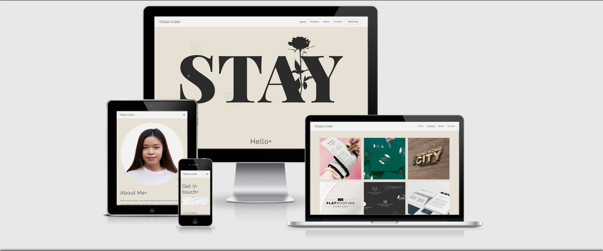
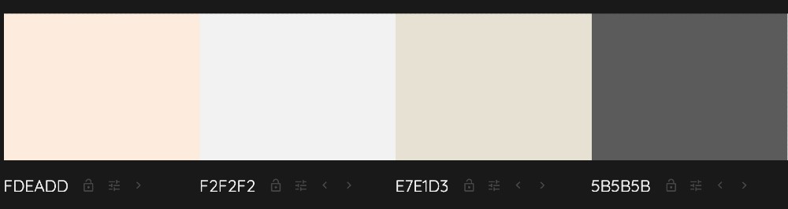

# <h1 align="center">Tessa Chan</h1>

A deployed link to the website can be found [here](https://twschan.github.io/CI_MS1_Tessa_Chan/)

## Goal For this Project
Welcome to Tessa Chan Designs! This is a portfolio website showcasing range of her past and latest projects as a graphic designer.
On this site you can find relevant information you need as a visitor, which grouped together in an appealing and accessible on a 
range of devices. The website is personalised by providing some information about the designer and images of her past and latest projects.

## Contents

- [User experience (UX)](#user-experience-(ux))
  * [User Goals](#user-goals)
  * [Site Owner Goals](#site-owner-goals)
  * [User Requirements and Expectations](#user-requirements-and-expectations)
    + [Requirements](#requirements)
    + [Expectations](#expectations)
  * [Design Choices](#design-choices)
    + [Colour Scheme](#colour-scheme)
    + [Typography](#typography)
    + [Icon](#icon)
    + [Imagery](#imagery)
    + [Structure](#structure)
  * [Wireframes](#wireframes)
  * [Features](#features)
     + [Existing Features](#existing-features)
     + [Features to Implement in the future](#features-to-implement-in-the-future)
  * [Technologies](#technologies)
     + [Languages Used](#languages-used)
     + [Libraries Frameworks and Programs Used](#libraries-frameworks-and-programs-used)
  * [Testing](#testing)

---
# User experience (UX)

### User Goals
* A website filled with valuable content 
* Website should be easy to use on a desktop, tablet and mobile
* Appealing visual elements
* Contact details should be easy to find
* A form to contact designer directly from site
* Website with creative call-to-actions
* Easy to navigate throughout the site to find content 

#### First Time Visitor Goals
1. As a First Time Visitor, I want to easily understand the main purpose of the site and learn more about the designer.
2. As a First Time Visitor, I want to easily find out information about the designer.
3. As a First Time Visitor, I want to be able to find the website is easily accessible and stand out from other designers.
4. As a First Time Visitor, I want to locate their social media links to see their followings on social media to determine how trusted and known they are.
5. As a First Time Visitor, I want to find information about her projects and various images about her designs.
6. As a First Time Visitor, I want to be able to reach out to the designer via the website.

#### Returning Visitor Goals
7. As a Returning Visitor, I want to find information and updates about her latest projects.
8. As a Returning Visitor, I want to find the best way to get in contact with the designer with any questions I may have.
9. As a Returning Visitor, I want to be able to get a downloadable CV of the site owner to easily share with others.

#### Site Owner Goals
10. As a site owner, I want users to see projects that showcase skills and growth.
11. As a site owner, I want to connect to potential jobs and projects.
12. As a site owner, I want to be able to contact the site owner easily for hire 
opportunities, collabrations and networking.

### User Requirements and Expectations

#### Requirements
* Easy to navigate by using the navigation menu
* Appealing visual elements
* Clear information about the designer
* Relevant content about each projects
* Easy way to contact the designer

#### Expectations
* When clicking on links e.g social media, I expect the page to open in a seperate browser.
* I expect a message to be entered when submitting the contact form and that the form has been submitted correctly.
* I expect the navigation links to work properly so that it takes me to wherever I want to go.
* Clear information on each projects.
---

# Design Choices

The style will be based on a minimalistic and simplicity approach that shows of the designer's
projects and make it more eye catching, a website that is subtle with good readability also an easy flow and navigation.
As this is a personal portfolio for the designer, the main inspiration and 
decisions will come from the designer own personal designs.

### Colour Scheme
The colour scheme are mostly muted tones to give the subtleness to the website and also to make the images stand out.

* #F2F2F2 Light Gray - Primary background-colour use to bring attention to design 
elements, good for dark on light designs.
* #E7E1D3 Beige - Secondary background-colour can go well with lighter tone images.
* #FDEADD Pale Orange - Overlay colour on buttons when hovered or selected and call-to-actions buttons.
* #5B5B5B Dark Gray - Header and text colour use on light designs.

### Typography 
To keep a modern style and for easy readability, the font used are Montserrat for headings
and Raleway for general text with Sans Serif as the fallback font incase for any reason the font isn't being
imported into the site correctly. These are taken from [Google](https://fonts.google.com/?preview.size=26&preview.text_type=custom&preview.text=TESSA%20CHAN) fonts library.

### Icon
I have decided to implement icons, using the [Font Awesome](https://fontawesome.com/) library.
The icons are designer's social media, a back-to-top arrow and hamburger icon for smaller media.

### Imagery
Imagery is important for a graphic designer portfolio, so choosing good images will
catch the users attention. All of the projects, logo and private owned images are from 
the site owner and the portrait used are the site owner photo.

### Structure
This website will consist four seperate pages a homepage (index.html), portfolio page, about page and a contact page with a contact form and also a link to download CV.
I have will be using [Bootstrap](https://getbootstrap.com/) to create an overall structure 
for the website, a Modal component to create the contact form and Carousel component for images for 
the homepage, the navigation bar will also be fixed on top. A responsive design will be added to the navbar and on small/mobile devices it will
condense into a hamburger icon that will have a toggle to view the nav menu and it's associated links.
This will save screen space and keep to conventions users are expecting.

---

# Wireframes
The wireframes are created by using the program [Balsamic](https://balsamiq.com/wireframes/). I created the mobile 
wireframe first so I get a rough idea what I want it to look like on a small media then moved onto tablet then desktop.

* Desktop Wireframe [View](docs/wireframe/desktop_wireframe.pdf)
* Tablet Wireframe [View](docs/wireframe/tablet_wireframe.pdf)
* Mobile Wireframe [View](docs/wireframe/mobile_wireframe.pdf)

---

# Features

## Existing Features

### Navigation

I have used Bootstrap to create a responsive navbar and implemented as well the 
hamburger icon for mobile devices to be more user-friendly. I decided to keep the navbar fixed on the top of the page, so user can easily navigate to other pages.

### Carousel - slideshow of images

I have decided to implement a Carousel across the index page, in order to make user curious about the designers portfolio. As it shows a few images at a time of her works.

### Introduction - Hello

Just a short Introduction about the designer herself. I have chosen to use icons from font awesome to showcase her skills of what she can do as a designer.

### Book Now & Modal

For the modal this will be used in the index page and the about page. This allow users to book a job with the designer by opening up a modal form. The book now button is also placed in the index page at the top and bottom, so the user won't need to scroll back up to find the button.

### Portfolio page

Here I used a grid from Bootstrap and card components with text overlay. It was more chanllenging, I implemented 9 images of the designer's work. By making sure I have used the correct grid system and responsive on all media also the images are spread evenly across the page. Then for the text overlay which provides information with a hover effect.

### About page

A photo of the designer with a hover effect and a link titled 'Show more' which will take the user to her portfolio page. Also a brief description about her, with background information and her education. Below the text there will also be a book now button with a modal pop up.

### Contact page

I have provided contacts and location details on the left and on the right is a contact form which users can fill in if they would like to get in contact with the site owner. I have also included a 'download CV' link for the user to download the CV on a new page.

## Features to Implement in the future

* Open images into another link with more details about each projects
* To implement the email function to deliver the messages from the user to the site owner. As well as letting the user verify their email
* Add a pricelist page, so user can see how much is the cost
* Possibly testimonials/references of the user to enhance more credibility and trust
* Interactive map for location with a link to google maps

---
# Technologies

## Languages Used

* [HTML5](https://en.wikipedia.org/wiki/HTML5)
* [CSS3](https://en.wikipedia.org/wiki/CSS)
* [JavaScript](https://en.wikipedia.org/wiki/JavaScript)

## Libraries Frameworks and Programs Used
* [Bootstrap](https://getbootstrap.com/docs/4.6/getting-started/introduction/)
  + To initial layout and styling before customising it
* [Font Awesome](https://fontawesome.com/)
  + Skills icons on homepage and social media icons in footer
* [Google Fonts](https://fonts.google.com/)
  + Used to import the Montserrat and Raleway fonts
* [Git](https://git-scm.com/)
  + Version control
* [Gitpod](https://www.gitpod.io/)
  + Used for editing my code
* [Balsamiq](https://balsamiq.com/)
  + Wireframes creation
* [Am I responsive?](http://ami.responsivedesign.is/)
  + This was used to generate the image of the website on different media
* [Tiny JPG](https://tinypng.com/)
  + To optimised the images I used on my site to minimise loading time 
* [Chrome devtools](https://developer.chrome.com/docs/devtools/)
  + This was used throughout development to troubleshoot, try out changes before changing codes, to test responsiveness and for testing performance of the final site with lighthouse.
* [Favicon](https://favicon.io/)
  + To make the site favicon
* [Colormind](http://colormind.io/)
  + Was used to display the colors shown in the color scheme section

---
# Testing 

Further testing information and reports can be found [here](TESTING.md).

